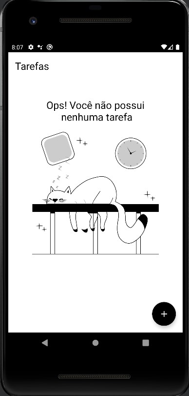
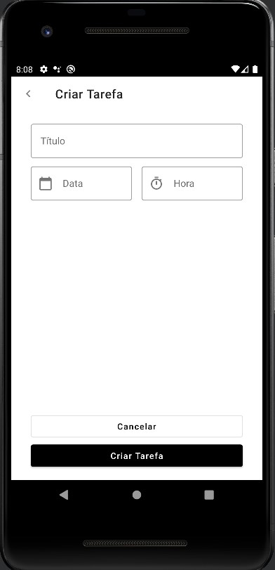

# LAB - Criando um app de lembretes e tarefas com Kotlin.

##  Descrição do Lab.
O objetivo do projeto é criar um App de `To do list` do zero mostrando o processo de desenvolvimento usando Kotlin, uma das linguagens de programação de maior ascensão dos últimos anos.

 

<h3 align="left">Connect with me:</h3>

<h3 align="left">Languages and Tools:</h3>

 
